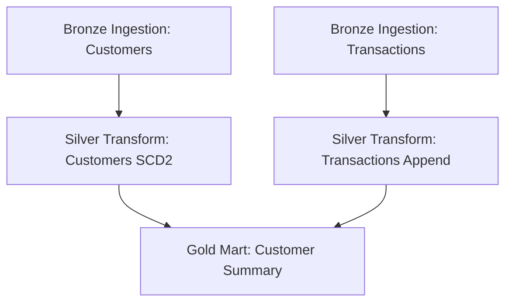

# LakeForge Orchestration Guide

This folder contains guidelines for orchestrating LakeForge pipelines on enterprise schedulers: Databricks Workflows, Apache Airflow, and Azure Data Factory.

---

## 1. Databricks Workflows

Databricks Workflows is the recommended scheduler for LakeForge pipelines due to direct integration with Unity Catalog, Job clusters, and notebook task logging.

### Ideal Multitask Job Structure
Our Terraform script deploys a job with the following dependency structure:



Each notebook is run on a shared **Job Cluster** to isolate compute costs.

---

## 2. Apache Airflow Integration

If you prefer external orchestration, you can trigger notebooks using the `DatabricksSubmitRunOperator` or `DatabricksRunNowOperator`.

### Example Airflow DAG
```python
from airflow import DAG
from airflow.providers.databricks.operators.databricks import DatabricksRunNowOperator
from datetime import datetime

with DAG(
    dag_id="lakeforge_etl_pipeline",
    start_date=datetime(2026, 1, 1),
    schedule_interval="@daily",
    catchup=False
) as dag:

    # Trigger Bronze Ingestion
    ingest_cust = DatabricksRunNowOperator(
        task_id="ingest_customers",
        job_id="123456",  # Databricks Job ID
        notebook_params={
            "config_path": "/Workspace/Users/jayarampogakula@gmail.com/lakeforge/config/pipeline_config.json",
            "pipeline_name": "customers",
            "environment": "prod"
        }
    )

    ingest_txns = DatabricksRunNowOperator(
        task_id="ingest_transactions",
        job_id="123456",
        notebook_params={
            "config_path": "/Workspace/Users/jayarampogakula@gmail.com/lakeforge/config/pipeline_config.json",
            "pipeline_name": "transactions",
            "environment": "prod"
        }
    )

    # Trigger Silver Clean
    clean_cust = DatabricksRunNowOperator(
        task_id="clean_customers",
        job_id="789012",
        notebook_params={
            "config_path": "/Workspace/Users/jayarampogakula@gmail.com/lakeforge/config/pipeline_config.json",
            "source_table": "customers",
            "target_table": "customers_clean",
            "use_scd_type2": "true",
            "environment": "prod"
        }
    )

    clean_txns = DatabricksRunNowOperator(
        task_id="clean_transactions",
        job_id="789012",
        notebook_params={
            "config_path": "/Workspace/Users/jayarampogakula@gmail.com/lakeforge/config/pipeline_config.json",
            "source_table": "transactions",
            "target_table": "transactions_clean",
            "use_scd_type2": "false",
            "environment": "prod"
        }
    )

    # Trigger Gold Aggregations
    gold_summary = DatabricksRunNowOperator(
        task_id="gold_summary",
        job_id="345678",
        notebook_params={
            "config_path": "/Workspace/Users/jayarampogakula@gmail.com/lakeforge/config/pipeline_config.json",
            "business_domain": "sales",
            "target_table": "customer_summary",
            "environment": "prod"
        }
    )

    ingest_cust >> clean_cust >> gold_summary
    ingest_txns >> clean_txns >> gold_summary
```
